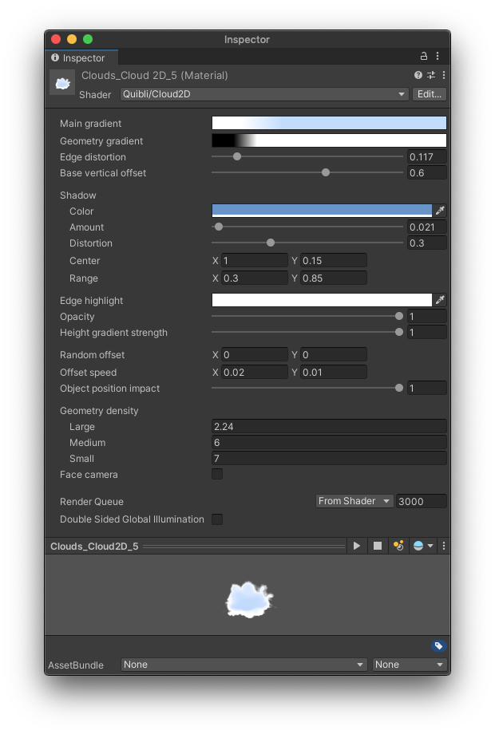
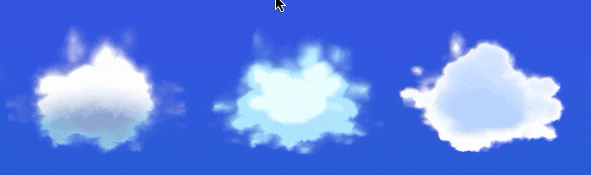

## Cloud2D Shader Brief Overview
_Cloud2D_ shader is an easy and flexible way to add the clouds to your scene. It works with 2D planes, or quads, and it works regardless of whether you have the skybox or not. The shader is applied to 2D objects like Quads.  
You can see _Cloud2D_ in action in the [City](../demo-scenes/#city-scene) demo scene and as a decorative clouds in the [Sample Scene with Quibli](../demo-scenes/#sample-scene-with-quibli).

This shader is on a bit more experimental side. Although this is a 2D effect, it still uses a lot of processing, specifically it works a lot with transparency, which can be hungry for the resources. Please, count that when creating the clouds: it is better for the performance to have one big cloud than a dozen of small ones.
{: .notice--warning}

{:.image-caption}
*Quibli Cloud2D Shader Interface*

_Cloud2D_ shader was made in a Shader Graph, so you can easily edit and modify it in the Shader Graph editor.  

When you move a cloud horizontally or vertically it is being continuously morphed upon the internal noise map. The effect is that when you duplicate it and move it anywhere, this copy will never look the same as the original source. It is handy, since you can effortlessly populate the sky with differently looking clouds just by copying and moving without the need of duplicating and altering materials for each copy. Moreover, if you animate the motion of these planes, you’ll get moving and, at the same time, always-changing clouds instead of static-shaped sprites/models.

## Beginning to Work with Cloud2D Shader

* Create a material
* In the **Inspector** panel, in the **Shader** drop down menu choose **Quibli** ▶︎ **Cloud2D**.
Now you can apply this material to a default Unity Quad model, for example.

## Parameters of the Cloud2D Shader

- **Main gradient** The parameter where you set the main colors of a cloud. Clicking on the Gradient ramp opens the _Gradient Editor_ where you can set up to color 8 stops. You can find more information about the _Gradient Editor_ in the part about the _Stylized Lit Shader_.

The same Gradient Editor is available for the following shaders: [Stylized Lit](../stylized-lit-shader), [Foliage](../foliage-shader), [Skybox](../skybox-shader), [Cloud3D](../cloud3d-shader), [Cloud2D](../cloud2d-shader). You can find the detailed explanation of the _Gradient_ in the ['Gradient' sub-chapter of 'Stylized Lit shader' chapter](../stylized-lit-shader/#gradient)  
{: .notice--info}

- **Geometry gradient**  Opens a similar _Gradient Editor_ as the one in _Main Gradient_. This gradient specifically uses black and white channel only, so it does not impact any color work but rather the shape of the cloud, more precisely, the fading out of the contour of a cloud into transparency. White color is fully visible (opaque), black is fully invisible (transparent). Thus, if you have a tightly placed black → white color stops, the edges of a cloud will be sharper than if the gradient would be more smooth. You can have up to 8 color stops.
- **Edge Distortion** Distorts the contour of a cloud using an internal noise map.
- **Base Vertical Offset** Moves a cloud upwards and downwards in an exponential way — it stretches the cloud near the extreme values of this parameter.
- **Shadow** This section responsible for controlling the shadowed region of the cloud. Usually this is the lower part of the object that does not receive direct sunlight.
- **Color** Sets the color of the shadowed part of a cloud. For example, you can use red-ish color for a sunset look.
- **Amount**  Sets how visible the shadow is.
- **Distortion** Controls the randomness of the shadow edge.
- **Center** Sets the coordinates of the center of the shadow.
- **Range** Sets how spread out the shadow is in horizontal (X) and vertical (Y) directions.
- **Edge Highlight** The color of a halo visible around the cloud.
- **Opacity** Sets how visible the _Edge highlight_ is.
- **Height Gradient Strength** Controls vertical shading of the cloud using the _Main Gradient_.
- **Random Offset** Changing the values on the axis scrolls the internal displacement map of a cloud against the mesh itself along that axis. Dragging the cloud itself and tweaking _Random Offset_ have the same effect, because translating the mesh does not preserve the noise seed it is being mapped to. The cloud is always being projected onto a static world-space internal noise map to form the fluffiness of it.  
_Random Offset_ can be used as a parameter to change the randomness seed and form unique clouds with otherwise same parameters.
Animating either this parameter or the cloud itself can be used to create the effect of a realistic ever-changing cloud. Please, look at the next parameter, _Offset Speed_, to apply a motion.  
  
*Animating the Random Offset parameter to create a cloud movement*
- **Offset Speed** Sets the speed of the pseudo-motion of the clouds. It is a pseudo-motion, because the planes carrying the _Cloud2D_ shader remain in place but the mapping onto the internal noise map is being offset, thus you see an illusion of the clouds moving. Please, see _Random Offset_ parameter description for additional explanation.  
_X_ value is for horizontal motion, _Y_ value is for vertical motion.  
Initially, the parameter is set to _X_ : 0, _Y_ : 0, which means, the clouds are static. If you change _X_ or _Y_ to positive numbers, the motion will be seen as to the right or upwards respectively. Dialing negative values 'moves' the cloud to the left or downwards respectively. The further the value is from '0', the faster the speed is.
- **Object Position Impact** Determines how cloud reacts to its position change. At the value of 0 the cloud doesn't change its shape while being moved. At the value of 1 a slight position change has a great impact on the cloud's shape. Placing the slider somewhere in the middle makes the cloud's shape morph slowly, like in real world.
- **Geometry Density** This is a group of parameters that control the small-, medium- and large-scale details of the cloud shape.
- **Large** Changes the size of large-scale details in the internal displacement map. Increasing the value makes the details smaller; decreasing the values makes the details larger.
- **Medium** Changes the size of medium-scale details in the internal displacement map.
- **Small** Changes the size of small-scale details in the internal displacement map.
- **Face Camera** It is a ‘billboard’ aka ‘always look into the camera’ effect, which is helpful in situations when the clouds may be approachable by the camera and not desired to be seen from an angle. So, as you are getting closer to the clouds, _Face Camera_ parameter makes sure the cloud will always rotate to look into the camera.

## Misc Info About the Cloud2D Shader
The _Cloud2D_ shader is made inside the Shader Graph. You can tweak and customize its core as you like. If you want to save your customization work, please do so through saving as a new shader file in order not to break the default one.

**NOTE.** In order to use a custom plane model, please make sure it is UV-unwrapped.
{: .notice--warning}

**TIP.** To make one complex-looking cloud in the demo scenes, we use two materials: one is dark inside and light outside, the second one is vice versa, darker on the edges. This way it is easier to emphasize the inner parts of the cloud chunks. You can have a look into the [Sample Scene with Quibli](../demo-scenes/#sample-scene-with-quibli) or into the [Nature](../demo-scenes/#nature-scene) demo scenes to see the effect.  
{: .notice--info}

