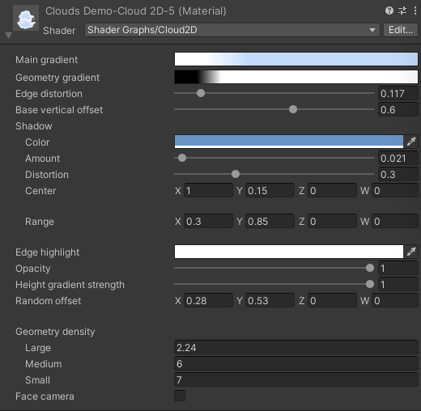

## Cloud3D Shader Brief Overview
_Cloud2D_ shader is an easy and flexible way to add the clouds to your scene. It works with 2D planes, or quads, and it works regardless of whether you have the skybox or not. The shader is applied to 2D objects like Quads. 

This shader is a bit more on the experimental side. Although this is a 2D effect, it still uses a lot of processing, specifically it works a lot with transparency, which can be hungry for the resources. Please, count that when creating the clouds: it is better for the performance to have one big cloud than a dozen of small ones.
{: .notice--warning}

  
*Quibli Cloud2D Shader Interface*

_Cloud2D_ shader was made in a Shader Graph, so you can easily edit and modify it in the Shader Graph editor.  

When you move a cloud horizontally or vertically it is being continuously morphed upon the internal noise map. The effect is that when you duplicate it and move it anywhere, this copy will never look the same as the original source. It is handy, since you can effortlessly populate the sky with differently looking clouds just by copying and moving without the need of duplicating and altering materials for each copy. Moreover, if you animate the motion of these planes, you’ll get moving and, at the same time, always-changing clouds instead of static-shaped sprites/models.

## Beginning to Work with Cloud3D Shader

* Create a material
* In the **Inspector** panel, in the **Shader** drop down menu choose **Quibli** ▶︎ **Cloud2D**.
Now you can apply this material to a default Unity Quad model, for example.

## Parameters of the Cloud3D Shader

- **Main gradient** The parameter where you set the main colors of a cloud. Clicking on the Gradient ramp opens the _Gradient Editor_ where you can set up to color 8 stops. You can find more information about the _Gradient Editor_ in the part about the _Stylized Lit Shader_.

The same Gradient Editor is available for the following shaders: [Stylized Lit](../stylized-lit-shader), [Foliage](../foliage-shader), [Skybox](../skybox-shader), [Cloud2D](../cloud2d-shader). You can find the detailed explanation of the _Gradient_ in the ['Gradient' sub-chapter of 'Stylized Lit shader' chapter](../stylized-lit-shader/#gradient)  
{: .notice--info}
