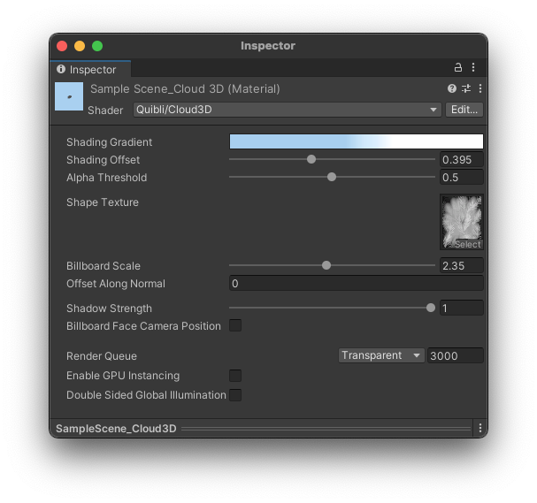

## Cloud3D Shader Brief Overview
_Cloud3D_ shader is an easy and flexible way to add the clouds to your scene. It works the best with the models processed with the [Foliage Generator](../foliage-generator). with the models  planes, or quads, and it works regardless of whether you have the skybox or not. The shader is applied to 2D objects like Quads. 

There are _Carrier models_ for the clouds included in Quibli, as well as are the presets for the _Foliage Generator_.
{: .notice--info}

{:.image-caption}
*Quibli Cloud3D Shader Interface*

_Cloud3D_ shader was made in a Shader Graph, so you can easily edit and modify it in the Shader Graph editor.  

## Beginning to Work with Cloud3D Shader

* Create a material
* In the **Inspector** panel, in the **Shader** drop down menu choose **Quibli** ▶︎ **Cloud3D**.
Now you can apply this material to an already done and included mesh in Quibli, or a model processed by the _Foliage Generator_. We'll discuss the creation process down on this page.

## Parameters of the Cloud3D Shader

- **Shading gradient** The parameter where you set the main colors of a cloud. Clicking on the Gradient ramp opens the _Gradient Editor_ where you can set up to color 8 stops. You can find more information about the _Gradient Editor_ in the part about the _Stylized Lit Shader_.

The same Gradient Editor is available for the following shaders: [Stylized Lit](../stylized-lit-shader), [Foliage](../foliage-shader), [Skybox](../skybox-shader), [Cloud3D](../cloud3d-shader), [Cloud2D](../cloud2d-shader). You can find the detailed explanation of the _Gradient_ in the ['Gradient' sub-chapter of 'Stylized Lit shader' chapter](../stylized-lit-shader/#gradient)  
{: .notice--info}

- **Shading Offset** _Shading Offset_ moves the gradient over the model. It’s a convenience parameter, because this effect can be also made by moving all the stop points in the _Gradient Editor_.
- **Alpha Threshold** Sets how much to cut out from the texture. The slider is a color darkness threshold at which the texture is being clipped. The texture should be black and white — where the black-colored part is being cut out by the shader.
- **Shape Texture** Here you can choose the texture by which the alpha is cut out using the _Clip Threshold_ parameter. You can view this texture as the one for the 'puffiness'  of the cloud's bump. In the _Foliage Generator_ it is called a _particle_ (the particles are described in the ['Parameters' section of the Foliage Generator](../foliage-generator#parameters-of-the-foliage-generator) chapter in this manual). Only red channel of the texture is used, which can be set in the texture's import settings (select the texture and set it in the Inspector panel).
- **Billboard Scale** Sets the scale of the branch textures aka particles (particles are described [here](../foliage-generator#parameters-of-the-foliage-generator). Effectively, using this parameter, you can scale the whole mesh. _Billboard Scale_ works only when billboards are active: when in the _Billboard Rotation_ parameter _Each Face_ or _Whole Object_ are selected.
- **Offset Along Normal** Slides the particles along the normals. Visually it 'inflates' or 'deflates' the mesh.
- **Shadow Strength** Controls the intensity of the self-shadowing effect. In the Shader Graph, there is no easy possibility to reduce the self-shadowing phenomenon. This parameter is our attempt at overcoming this limitation.
- **Billboard Face Camera Position** If enabled, the billboard will face the camera position. Otherwise, the billboard faces the camera plane. This makes billboards look nicer when camera rotates but is more expensive to render.
