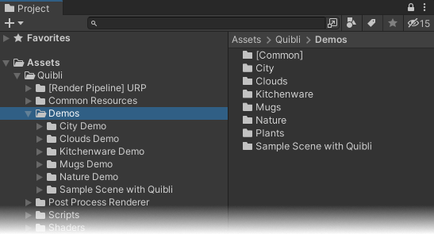
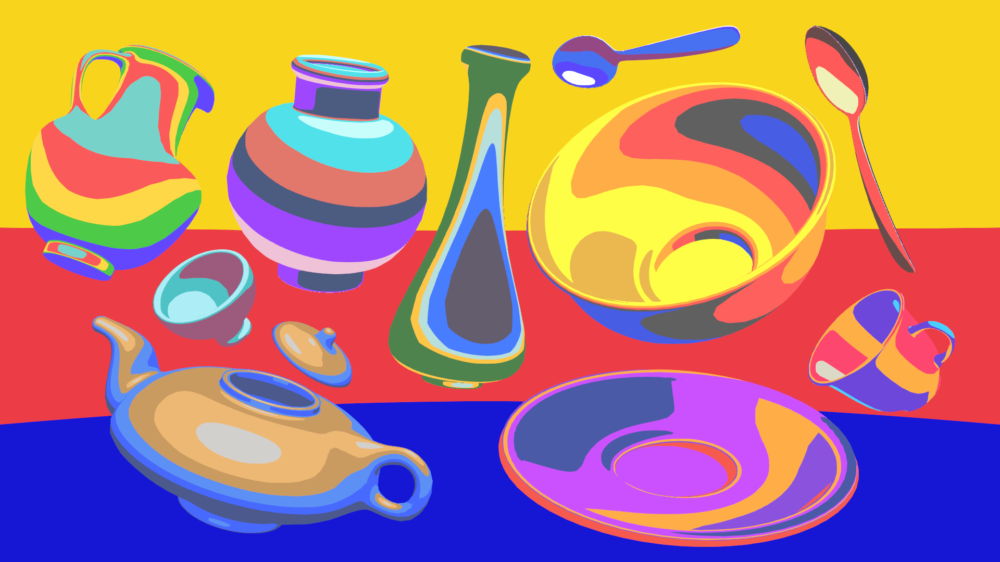

In the scenes we tried to showcase a variety of use cases for the Quibli shaders: [Stylized Lit](../stylized-lit-shader), [Foliage](../foliage-shader), [Grass](../grass-shader), [Skybox](../skybox-shader), [Cloud3D](../cloud3d-shader), [Cloud2D](../cloud2d-shader), [Light Beam]([../light-beam-shader) as well as the post effects and additional tools.  

Our demo scenes were made in _Linear Color Space_. If you use open Quibli Demo Scenes in  _Gamma Color Space_, the scenes will look differently.
{: .notice--warning}

The scenes can be found in:  
_**Project** panel ▶︎ **Assets** folder ▶︎ **Quibli** folder ▶︎ **Demo Scenes** folder_

{:.image-caption}
*Path to the Demo Scenes included in Quibli*

#### Nature Scene  
A detailed scene showing all the shaders in action. The foliage has been created using the [Foliage Generator](../foliage-generator) plugin. On this scene the shading of the plants has been made using [Foliage shader](../foliage-shader).    

#### City Scene  
Another detailed scene showing all the shaders and additional tools in action.  

#### Kitchenware Scene
This is a family of mostly saturated brightly colored scenes designed to show more unusual use of the [Stylized Lit shader](../stylized-lit-shader). Aside from the anime shading, it is possible to conveniently generate something unrelated, be it the basic coloring or something wild and unique. There is nothing unconventional going on, it is just the choice of the colors and the parameters that made up these scenes, particularly the Gradient editor settings on _Stylized Lit_ and [Skybox](../skybox-shader) shaders.  

{:.image-caption}
*Kitchenware Demo Scene 1 — smooth-mode Color Gradient ramp with vibrant colors*

{:.image-caption}
*Kitchenware Demo Scene 2 — smooth-mode Color Gradient ramp with color stops set tightly and loosely, with vibrant colors. The Skybox is made with the [Skybox shader](../skybox-shader), using a single color ramp, also with tight and loose color stops*

{:.image-caption}
*Kitchenware Demo Scene 3 — fixed-mode Color Gradient ramp with vibrant colors*

{:.image-caption}
*Kitchenware Demo Scene 4 — fixed-mode toon-looking Color Gradient ramp with monochrome colors*

#### Plants Scene
A scene showing a variety of plants made using the [Foliage Generator](../foliage-generator) and [Foliage Shader](../foliage-shader). On this scene, you can find an instance of the _Foliage Generator_ ready to be loaded with the also included presets that were used in this scene for the plants generation. The info about how to work with presets  in the _Foliage Generator_, is on [this chapter](../foliage-generator/#updating-the-existing-exported-models-later) of the _Foliage Generator_ page.

#### Mugs Scene  
As in [Flat Kit](https://flatkit.dustyroom.com/#6-demo-scenes){:target="_blank"}, we added the same demo scene contents to be used with Quibli's main shader — [Stylized Lit shader](../stylized-lit-shader) materials. This scene is made to showcase a fraction of styles that can be achieved with the _Stylized Lit_ shader. ‘A fraction’ is because these examples are only a few of the possible unique and unseen results due to the power of parameter combinations. We limited the colors to only one palette, making it easier to see the capabilities of the _Stylized Lit_ shader.  

{:.image-caption}
*Mugs demo scene*

#### Sample Scene with Quibli  
This is a modified start-up Unity scene, which you can see when you open a new project in Unity. We kept the original colors and textures, but changed some of the materials from the standard Unity Lit shader to the [Stylized Lit shader](../stylized-lit-shader), created the plants using the [Foliage Generator](../foliage-generator), shaded with the [Foliage shader](../foliage-shader), shaded the sky with the [Skybox](../skybox-shader), as well as added the clouds using the [Cloud2D shader](../cloud2d-shader). The character is also a standard Unity textured model prefab _Ellen_ from Unity 3D Game Kit learning resource, found [here](https://learn.unity.com/project/3d-game-kit){:target="_blank"}.  

#### Clouds Scene  
A showcase of a few examples of the [Cloud2D shader](../cloud2d-shader). The way the shader works can be utilized in a wide variety of creative use cases. As you can see, with _Cloud2D_ shader, it is possible to do more than clouds: fire, smoke, even some more unusual effects like northern lights.  

{:.image-caption}
*Clouds Demo Scene*
