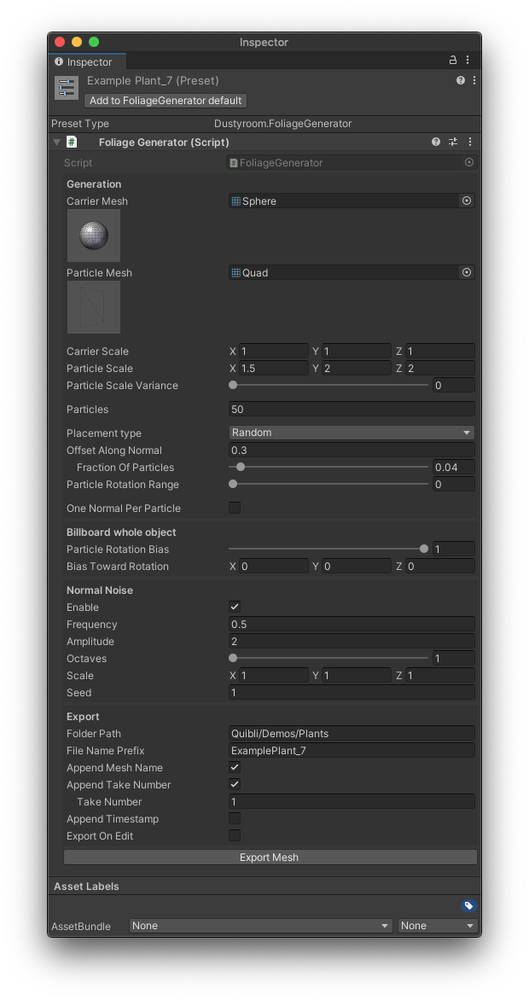
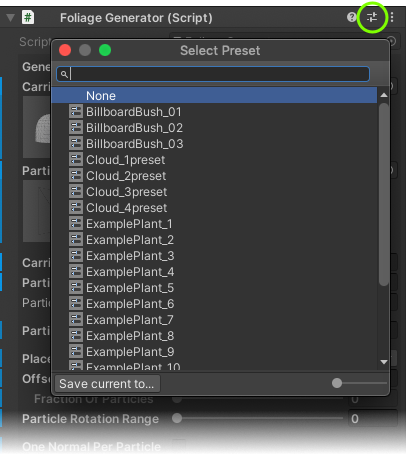

## Foliage Generator Brief Overview
Creating anime-looking bushes and trees requires not only specific shading but also properly created models in regards to display of the shading. This also applies to creating 3D clouds.
Of course, this can be done using a 3D-editors’ particle systems by combining both big and small emitters, but the good-looking plants would easily have 50 thousand vertices per model.  
So, another way is to create models from textured planes. The plants are usually modelled by placing (either carefully or haphazardly) the planes that contain the textures of the branches. The problem is that each of the quads has its own normal. After rotating and moving all the quads while forming, let’s say, a bush, all the normals would also be chaotically rotated and pointed in all imaginable directions. Thus, later in Unity, the shader would take each of the quads and apply its shading using data from all of these chaotic normals. Such a bush usually would not look well. Knowing this, you’d make the normals look better by borrowing them from something more simple like a sphere.  
But creating a bush and its variations still would take much time. Also, changing the number of faces sound like a hassle.  
_Foliage Generator_ prefab/component allows you to create a plant or a cloud in a few minutes, and then make changes instantly. It automatically forms the model from the ‘branch’ of your choice, wraps its copies (as many of them as you’d need) around a carrier model and handles the normals.  
After generating, the model appears in your project folder ready to be dragged onto the scene. Then you’ll need to just apply a material with the [Foliage](../foliage-shader) or [Cloud3D](../cloud3d-shader) shader containing a particle texture. We did all the foliage and 3D clouds models in the demo scenes this way. Quibli includes already made models, textures and materials.  
Another beautiful thing is that _Foliage Generator_ can take external models (there are nuances — described [here](#using-your-own-models)) and prepare their normals and apply the particles for you.  

{:.image-caption}
*Quibli Foliage Generator Interface*

Please, note that _Foliage Generator_ doesn't produce the trunks of the trees, neither does it create conventional flower plants. It works with included as well as external meshes and processes them so that the generated plants can work as stylized leafy parts of  the foliage. However, using the proper textures and a bit non-literal approach, the floral decorations can be created with the _Foliage Generator_.
{: .notice--warning}

It is highly recommended that you opened, for example, the [Plants demo scene](../demo-scenes/#plants-scene), located any of the plants in the _Hierarchy_ panel and experimented with its own _Foliage Generator_ instance. Pressing _Export Mesh_, will update this model. This way you can get to know the parameters better. And, please, remember that all parameters have mouseover tooltips. If you find any of them unclear, please, [shoot us an email](../contact-details) an we'll try to improve them.
{: .notice--info}

## Beginning to work with Foliage Generator

The _Foliage Generator_ can be loaded into a scene in two ways.

### Loading Method #1 — Prefab

To start working with the _Foliage Generator_ as a Prefab, please do the following:

1. Locate the **Foliage Generator prefab** in
_**Project** panel ▶︎ **Assets** folder ▶︎ **Quibli** folder ▶︎ **Common Resources** folder ▶︎ **Prefabs** folder_;
1. Drag it to the Hierarchy panel or directly into the scene;

### Loading Method #2 — Component

Another way to add the _Foliage Generator_ to the scene is to use it as a Component.

  1. Create an empty Game Object: right-click in the empty space in the **Hierarchy panel** ▶︎ select and click **Create Empty**;
  1. Select the created empty Game Object;
  1. In the **Inspector panel**, please, click **Add Component**;
  1. Search for ‘Foliage Generator’, or locate it manually under **Scripts** ▶︎ **Dustyroom** ▶︎ **Foliage Generator**. Click on it once found;
  1. It is ready to be tweaked.

### Operating the Foliage Generator After Loading

When you have the _Foliage Generator_ loaded to the scene, you'll probably want to [adjust the parameters or load an existing preset](#parameters-of-the-foliage-generator) and will need to [apply a material to an exported mesh](#shading-generated-model) — to finalize the plant model. Please, keep reading this chapter to get acquainted with the details of doing these steps.

  1. Adjust needed parameters or load a preset. The explanation of the parameters can be found [below](#parameters-of-the-foliage-generator);
  1. Click _Export Mesh_ button;
  1. Locate an exported model in the export target folder. The path to this folder is set in the _Folder Path_ parameter in [Parameters of Export](#parameters-of-export);
  1. Add this model in your scene (it looks pink);
  1. Apply the material to it.

## Parameters of the Foliage Generator

### Generation Parameters

**Generation**
A group of parameters that control the creation of the plant mesh.

- **Carrier Mesh** The triangles of this mesh are used for placement of the spawned _Particles_. Quibli comes with a handful of these. Also, of course, you can create your own ones. Think of it as a 'core' of the future plant/cloud model.
- **Particle Mesh** The building block of the foliage. Multiple copies of this mesh are combined in the exported mesh. In other words, this is what would be a ‘branch’ of the plant. These particles aka branches are applied to the _Carrier Mesh_ to form the resulting plant model. You can use the simplest Quad model from Unity or select one from Quibli’s package.
- **Carrier Scale** Scaling applied to the _Carrier Mesh_ when spawning _Particles_. The bigger the _Carrier Mesh_, the more pronounced the shape of the resulting plant model would be.
- **Particle Scale** Scaling applied to each individual _Particle_. This parameter controls how large the ‘branch’/'puff' of the plant/cloud model would be. The smaller the values the more detailed the resulting mesh is going to be. More so, if the _Carrier Scale_ values are high, smaller branches will contribute to the overall shape of the _Carrier Mesh_. If the _Particle Scale_ values are high, the resulting plant’s look would have less of the initial _Carrier Mesh_’s shape. Lower values (~0.05—1) are good for **non-billboards** and **billboards** in [Each Face](../foliage-shader/#global-billboard-parameters) mode (which is set in _Foliage Shader_), higher values (~0.5—3) are suitable for **billboards** in [Whole Object](../foliage-shader/#global-billboard-parameters) mode, [explained here](#how-to-create-a-basic-plantcloud).
- **Particle Scale Variance** Randomness of scale applied to each individual _Particle_.
- **Particles** A number of _Particles_ to generate. In other words, this parameter sets how many of the branches the plant will have. Higher values (~250—1000) are good for **non-billboards** and **billboards** in [Each Face](../foliage-shader/#global-billboard-parameters) mode (which is set in _Foliage Shader_), lower values (~25—150) are suitable for **billboards** in [Whole Object](../foliage-shader/#global-billboard-parameters) mode, [explained here](#how-to-create-a-basic-plantcloud).
- **Placement Type** Determines how to distribute the particles over the _Carrier Mesh_. Parameter has two options: **Random** and **Uniform**. _Random_ populates the particles chaotically, _Uniform_ distributes the particles evenly over the _Carrier Mesh_'s surface. It is an important parameter for **billboarding**, [explained here](#how-to-create-a-basic-plantcloud).  

The **Placement Type** parameter in **Uniform** mode is useful when engaging **Billboard Rotation** → **Each Face** mode in the _Foliage_ shader, [described here](../foliage-shader/#global-billboard-parameter).
{: .notice--info}

The **Placement Type** → **Uniform** mode is suitable for 3D clouds making, as the _Billboard Rotation_ → _Each Face_ mode is hardwired in [Cloud3D shader](../cloud3d-shader).
{: .notice--info}

- **Offset Along Normal** ‘Inflates’ the mesh by moving each _Particle_ along the _Carrier Mesh_ normal by this value.
- **Fraction of Particles** Defines which particles offset is applied to. The value of 1 means all particles are offset. Useful to create branches that stick out of the general foliage shape. This parameter is grayed out when _Offset Along Normal_ is at the value of 0 — as soon as you change the latter, the former will become available for tweaking.  
- **Particle Rotation Range** How much _Particle_ rotation can deviate from _Carrier Mesh_ normals.
- **One Normal Per Particle** If enabled, the vertices within each _Particle_ will have the same normal values.

### Billboard Whole Object Parameters

**Billboard Whole Object** is a group of parameters that prepare rotation of the _Particles_ in order for the generated mesh to be used as a [Billboard](#billboard-approach). **Billboarding** is [explained here](#how-to-create-a-basic-plantcloud).

- **Particle Rotation Bias** Forces the _Particles_ to face the positive X axis.  
- **Bias Toward Rotation** Sets the rotation on the axis for the _Particle Mesh_.

**TIP.** _Particle Rotation Bias_ is useful for billboard foliage. ‘Billboard’ means that the meshes always face the camera regardless of the camera’s position and rotation. It is a handy feature because you can make up the plant model from only a handful of planes to spare resources, and this plant will always create an impression of a more complex one.
{: .notice--info}

### Normal Noise Parameters

**Normal Noise** is a group of parameters that control the nonlinearities in the normals of the generated mesh.
- **Enable** Turns the _Normal Noise_ group on.
- **Frequency** The period of the cycle at which the noise is sampled. In other words, how dense the noise is.
- **Amplitude** The range of the noise from its minimum to its maximum effect.
- **Octaves** The number of layers of details of the noise. Combining low-level with high-level details results in more natural-looking output.
- **Scale** The scale of the internal noise map that controls the nonlinearities.
- **Seed** A fixed 'footprint', or a 'snapshot' of the noise.

### Parameters of Export

**Export** is a set of parameters for controlling the export process of the generated mesh.

- **Folder Path** This is where the generated model will go once you export it. You can type in any path starting with 'Quibli', or leave it blank to export the mesh into the _Assets_ folder. If the target folder doesn't exist, the script will create it. For instance, all common generated models are here (copy and paste this path in the _File Name Prefix_ field):  
_Quibli/Demos/[Common]/Models/Foliage Generator Exported Meshes_
- **File Name Prefix** is a part of the title of the model that is going to be generated.
- **Append Mesh Name** Adds the _Carrier Mesh_ name to the name of the exported mesh.
- **Append Take Number** Adds the value from the _Take Number_ field to the exported filename.
- **Take Number** This is the current iteration number of the model. Only used if “Append Take Number” is enabled.
- **Append Timestamp** Enables the option to add time to the name of a generated mesh.
- **Export On Edit** If enabled, the mesh will be automatically updated and overwritten upon every change of any of the parameters of the _Foliage Generator_. It is useful for a rapid preview of the changes to the parameters.
- **Debug / Export Debug Mesh** This is the tick box, which lets you export the initial _Carrier Mesh_ without the branches / _Particle Meshes_ but with all the processing applied to it. It is useful if you need to see what’s going on if you are struggling with the shape and look of the filial generated foliage model.
- **Export Mesh** This is a button, which generates the final foliage model. Once generated, it is placed in the folder selected in the _Folder Path_ parameter's field. To use this mesh in your scene, drag and drop it from that folder to the scene. The model will look pink at first, because so far it has no material applied onto it. You can use the ready materials from the Demo scenes or create your own. Shading the exported models is described [here](#shading-generated-model).

Every time you press the _Export Mesh_ button, the generated model is slightly different, as each time the new seed of random is used.

When a model is generated, the _Foliage Generator_ gives this model a name, which consists of prefixes like ‘Carrier Mesh’, a word from the ‘File Name Prefix’ field and an optional time stamp. Pressing _Export Mesh_ will always create a new model every time you use a different _Carrier Mesh_ (because the exported name will be different). Otherwise, _Export Mesh_ will just overwrite the existing model and will update it in a scene.

**TIP.** It is convenient to use presets with _Foliage Generator_: every time you export a nice model, save the parameters for later. After changing everything up on the _Foliage Generator_ interface you can always load a preset (preferably previously titled in a proper way) to fix that bush that bothers you, as long as the name of the existing mesh is going to be the same as the name of the re-exported mesh.
{: .notice--info}

## How to Create a Basic Plant/Cloud

<iframe width="560" height="315" src="https://www.youtube.com/embed/MfTuySe2gJY" title="YouTube video player" frameborder="0" allow="accelerometer; autoplay; clipboard-write; encrypted-media; gyroscope; picture-in-picture" allowfullscreen></iframe> 

*A brief tutorial on creating and shading a basic plant in non-billboard, billboard 'Each Face' and billboard 'Whole Object' modes*
{:.image-caption}

Creating a finished model consists of two steps:
1. Generate the mesh from _Mesh Carrier_ and _Mesh Particles_ using _Foliage Generator_, export it. The exported model will have only the _Particles_ visible, the _Carrier Mesh_ won't be exported.
2. Shade the plant model using [Foliage Shader](../foliage-shader), where you apply the colors, textures of branches to the _Particles_, wind and make the model a **billboard** or a **non-billboard**. For the 3D cloud models, please use the [Cloud3D shader](../cloud3d-shader). The _Cloud3D_ shader has an embedded billboarding (_Each Face_ type, we'll explain it later in this documentation).

When creating a plant (or a cloud — they have common creation approach) model, we suggest to think in advance how many [particles](#generation-parameters) it should have, where it will be placed in the scene and how large the _Particles_ and _Carrier Mesh_ are going to be. It is important, because in the end the mesh will be made either as **billboard** or **non-billboard**/regular mesh. In addition to this, billboarding is the way to create uniquely looking plants/clouds, which are impossible to create otherwise.    
If you are going after a **non-billboard** model, the number of _Particles_ is going to be high (something like 500—1000) — to cover whole _Carrier Mesh_ surface area without gaps. The size of _Particles_ is usually small (around 0.05—1) — should the particles be high, the non-pleasant plane intersections will be visible. These ranges apply to **billboards** in [Each Face](../foliage-shader/#global-billboard-parameters) mode as well.  
If you are making a model as a *billboard* in [Whole Object](foliage-shader/#global-billboard-parameters) mode, the _Particles_ may be bigger and you can have much less of them: you won't see the _Particles from the sides and the intersections won't be as much obvious. For such billboards, the shader will take this handful of Particles and 'squash' them in the camera direction, which will create an illusion of the full-bodied model.

Below you can see how **billboard** and **non-billboard** behave with camera's rotation and position change. This behavior is set in [Foliage shader](../foliage-shader).

|---|---|---|
||||
|*Billboard: Nothing*|*Billboard: Each Face*|*Billboard: Whole Object*|

### Billboard approach
**Billboard** means that the whole object or just its particles/branches always look into camera. Whether it's a whole object or only its particles is determined by the [Foliage Shader's Global Billboard parameters](../foliage-shader/#global-billboard-parameters), as well as by some of the [Generation Parameters](#generation-parameters) here, in the _Foliage Generator_. Particularly, 

- In _Foliage Generator_:
  * **Particle placement type**
  
You'll need to choose between **Random** placed branches: for chaotic branch distribution, or **Uniform** placed branches: for the branches to be placed on the faces of the [Carrier Mesh](#generation-parameters). Please, look into the descriptions of these parameters, described above. For 3D cloud creation, we suggest using _Uniform_ mode.

  * **Billboard whole object** group of parameters (_Particle Rotation Bias_ and _Bias Toward Rotation_)
  
If you want the whole mesh to be looking into the camera, set _Particle Rotation Bias_ to the maximum right position. It will force the branches always look where the following parameter, _Bias Toward Rotation_, is set. Here you don't have to change anything from zeroes if you have already camera-facing _Mesh Particle_, which you can see in the small mesh preview icon in the parameter's interface. If it is facing any other direction, you'll need to rotate it using _Bias Toward Rotation_ parameter's axis.

- In _Foliage Shader_:
  * **Billboard Rotation** parameters, [described in detail on the Foliage Shader page here](../foliage-shader/#global-billboard-parameters).  
  
If you want the whole mesh to be looking into the camera, please, choose **Whole Object**.  Usually, for the construction of such billboard models you'll need only up to 25—150 large (value of ~1) _Particles_, which is relatively low poly, if you use a [Quad](https://docs.unity3d.com/Manual/Example-CreatingaBillboardPlane.html){:target="_blank"} as a _Particle Mesh_ (_Carrier Mesh_ and _Particle Mesh_ are described above in the [Generation Parameters](#generation-parameters)).  
If you want the mesh itself NOT to be rotating, but rather its particles/branches, please, choose **Each Face** mode. **It is better to use _Each Face_ mode in conjunction with _Uniform_** _Particle Placement Type_ parameter of the _Foliage Generator_, described above.  

### Non-Billboard approach
**Non-Billboard** foresees the commonly understood behavior of the meshes: they do not rotate with camera movement and they usually require more particles in order to cover its whole surface area, unlike the billboards, where _only the front (in 'Whole Object' Billboard mode)_ or _only the particles/branches (in 'Each Face' Billboard mode)_ of the model will always be visible to the camera.

### Shading Generated Model
The _Foliage Generator_ and [Foliage shader](../foliage-shader) with [Cloud3D shader](../cloud3d-shader) are best buddies. These shaders work specifically on the models created by the _Foliage Generator_. Particularly, [Billboarding](#billboard-approach) has to be set in both _Foliage Generator_ and _Foliage Shader_.

The _Foliage Generator_ script makes up a mesh ready to be imported in your scene, but to finalize its look, the material is needed.
  * **For foliage** Use the specialized [Foliage shader](../foliage-shader). Its niche controls give access to finer details in regards to finalizing the shaping of the models look, and not only the coloring. It has a _Wind_ set of parameters, the color controls are more streamlined for working with Foliage, a separate slot for alpha clipping map. The beautiful thing is that this shader can also turn the foliage models not made by the _Foliage Generator_ into plants. More on this you can find in [Foliage shader](../foliage-shader) chapter.
  * **For the clouds**, use [Cloud3D](../cloud3d-shader) shader.

When you drag the exported plant or cloud model into the scene, you'll notice that it is pink, which tells that it is has no material yet. You can create a [Foliage](../foliage-shader/#beginning-to-work-with-the-foliage-shader) or [Cloud3D](../cloud3d-shader/#beginning-to-work-with-cloud3d-shader) material or choose one the bundled materials coming with Quibli, and either drag it onto the model, or select a material in the model's _Mesh Renderer_.

## Using Your Own Models

_Foliage Generator_ can process external models that are used as _Carrier Meshes_ (more about what is a _Carrier Mesh_ is [here](#generation-parameters)). Foliage Generator processes the normals and UVs of those meshes according to the parameters you set in its interface, so that the applied _particles_ would look suitable.  

  
*For custom Carrier meshes, it is recommended to use the models that have as even quad distribution as possible. Such models would carry the particles evenly, so that the exported meshes won't have unfilled gaps on their surface.*
{:.image-caption}

Another important moment in choosing a custom _Carrier Mesh_ is to look if it is convex. Even if the model is concave, it is still better to not use the solidified thin models that have big parts of surface closely located. In the example below you can see that outer and inner surface parts of the vase are located very closely to each other. In the end Foliage Generator will place branches on both outer and inner parts of the vase, and in addition to that, they will be crossing each other.  

  
*Please, try not using thin solidified models, as the particles will be on both sides and they may be crossing each other badly.*
{:.image-caption}

## Next Steps After Using Foliage Generator

### Updating Existing Exported Models

If you didn't change the name of the exported model after you created and used it, and given that you didn't change any parameters that contribute to the name of the exported mesh in the ongoing _Foliage Generator_ interface (see the descriptions of the parameters above), you can always come back to the _Foliage Generator_ in any of the scenes ([load the script](#beginning-to-work-with-foliage-generator) anywhere, anytime) and update the exported mesh — change the _Particle Scale_ or _Particles_ parameters, for example, as soon as the model is exported, it will update existing one. That's where saving presets of the _Foliage Generator_ is useful. Please, see the screenshot below.

{:.image-caption}
*Using the Preset menu for the Foliage Generator*

