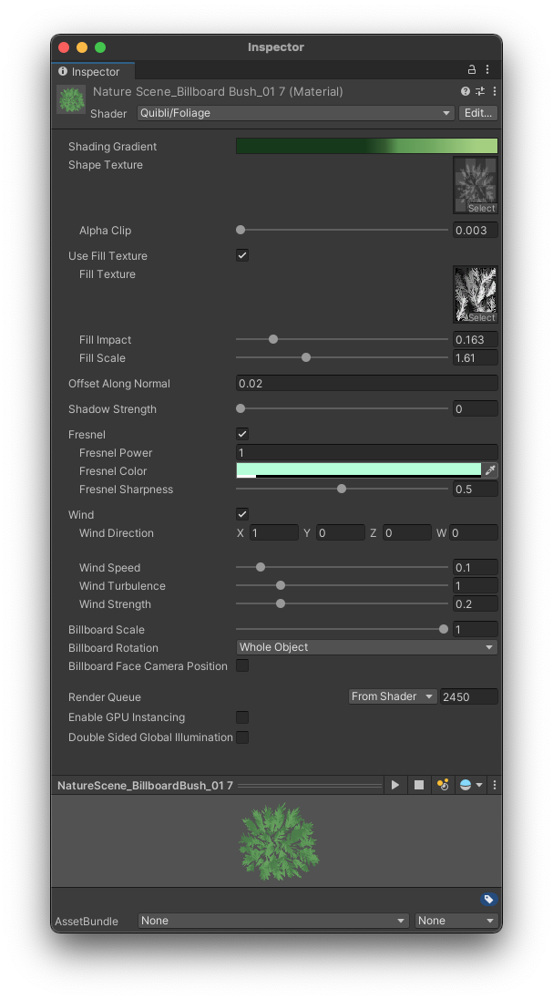

## Foliage Shader Brief Overview

The _Foliage_ shader is a specialized shader to be used with the models to give them a foliage look. We're talking not only about the ones made using the [Foliage Generator](../foliage-generator) tool, but also other models, including primitives, letters, monkeys, everything you usually want to cover with leaves.

{:.image-caption}
*Quibli Foliage Shader Interface*

It is highly recommended that you opened, for example, the [Plants demo scene](../demo-scenes/#plants-scene), located any of the plants in the _Hierarchy_ panel and experimented with its own material, which carries the _Foliage Shader_. Please, remember that all parameters have mouseover tooltips. If you find any of them unclear, please, [shoot us an email](../contact-details) an we'll try to improve them.
{: .notice--info}

## Beginning to Work with the Foliage Shader

  1. Create a material;
  1. In the **Inspector** panel, in the **Shader** drop down menu choose **Quibli** ▶︎ **Foliage**;
  1. Now you can apply this material to an object on the scene or to a prefab.

## Parameters of the Foliage Shader

### Coloring Parameter (Gradient)

**Shading Gradient** Opens the Gradient Editor where you can choose the colors for the material.

The same Gradient Editor is available for the following shaders: [Stylized Lit](../stylized-lit-shader), [Foliage](../foliage-shader), [Skybox](../skybox-shader), [Cloud3D](../cloud3d-shader), [Cloud2D](../cloud2d-shader). You can find the detailed explanation of the _Gradient_ in the ['Gradient' sub-chapter of 'Stylized Lit shader' chapter](../stylized-lit-shader/#gradient)  
{: .notice--info}

### Texturing Parameters

- **Shape Texture** Here you can choose the texture by which the alpha is cut out using the _Alpha Clip_ parameter. You can view this texture as the overall shape of the plant's branch (a particle — the particles are described in the ['Parameters' section of the Foliage Generator](../foliage-generator#parameters-of-the-foliage-generator) chapter in this manual). Only red channel of the texture is used, which can be set in the texture's import settings (select the texture and set it in the Inspector panel).
- **Alpha Clip**  Sets how much to cut out from the texture. The slider is a color darkness threshold at which the texture is being clipped. The texture should be black and white — where the black-colored part is being cut out by the shader. It is better if the black part is around the leaf / branch part and has some gradual spots inside. It is better to see the examples in the included _Common Textures_ folder.
- **Fill Texture** This is a detail texture to be used over the branch / particle defined by _Shape Texture_.
- **Fill Impact** Sets how visible the _Fill Texture_ is. Higher values make the texture more visible.
- **Fill Scale** Sets the scale of the _Fill Texture_.
- **Offset Along Normal** Slides the particles along the normals. Visually it 'inflates' or 'deflates' the mesh.

### Additional Coloring Parameters

- **Fresnel Power** Sets the visibility of the fresnel property of the object. The fresnel effect provides stronger reflection on the flatter view angles (think edges of mesh, contour of the sphere) and weaker reflection in the steeper view angles (center of a mesh).

{:.image-caption}
*Fresnel effect*

- **Fresnel Color** Defines the color of the fresnel effect.
- **Shadow Strength** Controls the intensity of the self-shadowing effect. In the Shader Graph, there is no easy possibility to reduce the self-shadowing phenomenon. This parameter is our attempt at overcoming this limitation. 

### Wind Parameters

The _Wind_ part of the shader allows you to apply a shader-based displacement to the mesh(-es) the material is applied to. The movement is reminiscent of grass bending in the wind.

- **Wind** Toggles the _Wind_ section of the shader.
- **Wind Direction** The direction of the motion.
- **Wind Speed** How fast the material displaces the object.
- **Wind Turbulence** Introduces nonlinearities to the object’s motion.
- **Wind Strength** The amount of deviation of the object from its initial position. In other words, it is how strong the movement is.

### Global Billboard Parameter

- **Billboard Scale** Sets the scale of the branch textures aka particles (particles are described [here](../foliage-generator#parameters-of-the-foliage-generator). Effectively, using this parameter, you can scale the whole mesh. _Billboard Scale_ works only when billboards are active: when in the _Billboard Rotation_ parameter _Each Face_ or _Whole Object_ are selected.
- **Billboard Rotation** Defines how the particles / branches are being rotated with the move of the camera.

‘Billboard’ means that the meshes always face the camera regardless of the camera’s position and rotation. It is a handy feature because you can make up the plant model from only a handful of planes to spare resources, and this plant will always create an impression of a more complex one.
{: .notice--info}

_Billboard Rotation_ parameter has three options:
  * **Nothing** — bypasses the billboard rotation;
  * **Each Face** — rotates each individual face;
  * **Whole Object** — rotates the whole object; the individual faces don't change relative rotation.

{:.image-caption}
*Foliage Shader Billboard Rotation parameter options*
