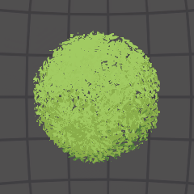

- **Billboard Rotation** Defines whether the model will to act as a billboard or a non-billboard (regular mesh). If in _Each Face_ or _Whole Object_ mode, the model becomes a billboard. This parameter sets how the particles / branches are being rotated with the movement of the camera. _Billboard Rotation_ parameter has three options:  

{:.image-caption}
*Foliage Shader Billboard Rotation parameter options*
  * **Nothing** — bypasses the billboard rotation, meaning, the model is a non-billboard;  

| *Billboard: Nothing* |
| --- |
|  111|

|---|
| 222|
|*Billboard: Nothing*|

|---|---|
| 333| 333|
|*Billboard: Nothing*|*Billboard: Nothing*|

  * **Each Face** — rotates each individual face, while the overall object shape stays non-rotating. It is one of the billboarding methods;  

  * **Whole Object** — rotates the whole object; the individual faces don't change relative rotation. Like the _Each Face_ mode, this mode is one of two billboarding methods.  

- **Billboard Face Camera Position** If _Billboard Rotation_ is enabled, the billboard will face the camera position. Otherwise, the billboard will face the camera plane. This makes billboards look nicer when camera rotates but is more expensive to render.
