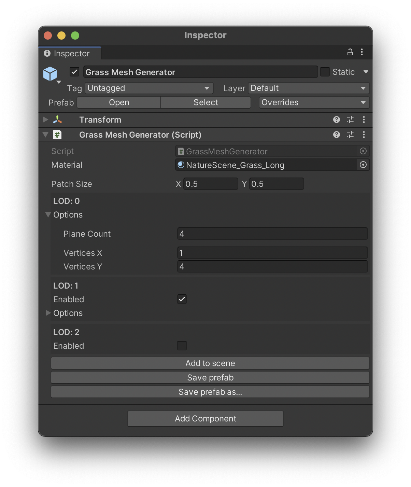
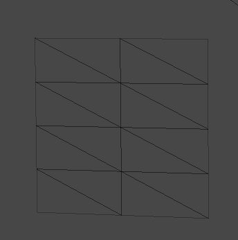

## Grass Generator Brief Overview
_Grass Generator_ is a simple tool that creates a mesh for one patch of grass. This mesh has multiple variants for different [Levels Of Detail](https://docs.unity3d.com/Manual/LevelOfDetail.html) which are all packed into one Game Object with the LOD settings populated automatically.

The mesh is generated from scratch and consists of a few intersecting quads. This makes sure the grass looks good from any horizontal angle while keeping the performance cost to a minimum.

{:.image-caption}
*Quibli Grass Generator Interface*

Please note that _Grass Generator_ doesn't populate the trass patches on the scene, for that you can use any prefab painting asset, for example, Polybrush.
{: .notice--info}

## Beginning to work with Grass Generator

To start working with the _Grass Generator_, please do the following:

1. Locate the **Grass Generator prefab** in
_**Project** panel ▶︎ **Assets** folder ▶︎ **Quibli** folder ▶︎ **Prefabs** folder_;
1. Drag it to the Hierarchy panel or directly into the scene;

## Parameters of the Grass Generator

- **Material** The material applied to the generated grass patch. Please use _Quibli/Grass_ shader on the material.
- **Patch Size** The width (X) and height (Y) of the grass patch in meters.

### Parameters of each LOD level

The _Grass Generator_ can create up to three LOD levels, each with own parameters. The general idea is that each next LOD level should be simpler than the prevous one.

- **Plane Count** The number of intersecting planes in the grass patch. The higher numbers lead to better looking grass, but increase the performance cost.
- **Vertices X** The number of horizontal points in each generated plane. This value is related to the wind motion in the Grass shader. Higher subdivision values lead to better wind motion, but increase the performance cost of the grass. The image below is a wireframe of one grass plane with _Vertices X_ set to 2 and _Vertices Y_ set to 4.
- **Vertices Y** Same as _Vertices X_, but the subdivision is vertical. Because of how the wind moves the grass, this parameter is generally more important than _Vertices X_.

{:.image-caption}
*Grass Plane Vertices (X: 2, Y: 4)*

## Export options

- **Add to scene** This button generates a grass patch and adds a 'Grass Patch' object to the root of the current scene hierarchy.
- **Save prefab** Same as above, but this will also export the grass patch as a prefab to the root of the 'Assets' folder, or to a location where you saved the prefab previously. This button is useful while tweaking the _Grass Generator_ parameters because it will update all the grass patches on the scene.
- **Save prefab as...** Same as above, but instead of quietly overwriting the prefab, you can specify a new filename and location.

## Placing the grass

Once you have the prefab exported to your assets, you can use any prefab placement tool to spread it across the scene.

For example, Unity's [Polybrush package](https://unity.com/features/polybrush) has a 'Scatter Objects' feature that is suitable for placing grass on terrain or other objects.

Depending on which tool you use, you might need to add a collider to the grass prefab. A good way of doing this is to add a sphere collider to the root of the grass prefab and removing the collider component once the grass has been placed. This way the grass on the scene doesn't have the collider which would be unused.
{: .notice--warning}
