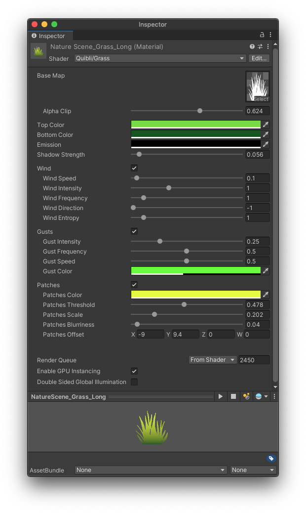

## Grass Shader Brief Overview

The _Grass_ shader is a specialized shader to be used with the grass foliage.

{:.image-caption}
*Quibli Grass Shader Interface*

## Beginning to Work with the Grass Shader

  1. Create a material.
  1. In the **Inspector** panel, in the **Shader** drop down menu choose **Quibli** ▶︎ **Grass**.
  1. Now you can apply this material to an object on the scene or to a prefab (for example, a grass sprout).

A grass sprout is a single instance of the plane carrying the _Grass_ material. To fill the scene with this instance, you can distribute the grass sprouts either manually (which would, probably, take forever), or using a 3rd party prefab placement tool. We haven't tested all of such tools, but, in order to work properly, they can have their own workflow nuances, like a requirement of adding a collider to the sprout mesh before you paint with this mesh. Please, refer to their manuals or tutorials to get to know them better.
{: .notice--warning}

## Parameters of the Grass Shader

### Texture and Color Parameters

- **BaseMap** Texture with alpha channel defining the shape of a grass blade. We included a collection of these textures in Quibli, but you can of course use your own textures.
- **Alpha Clip** Threshold at which the 'Base Map' alpha channel is cut off.

If you make the grass blade image to falloff into the alpha gradually, the _Alpha Clip_ can be useful in making the grass thicker or thinner.
{: .notice--info}

- **Top Color** The color of the upper part of the grass blade. This color and the color from the _Bottom Color_ parameter are interpolated.
- **Bottom Color** The color of the lower part of the grass blade. This color and the color from the _Top Color_ parameter are interpolated.
- **Emission** Color added to the final grass shading value. Useful to adjust the look of the whole material, including wind, gusts, etc.
- **Shadow Strength** Controls intensity of the shadow coming from the main light of the scene. The value of 0 results in ignoring shadows, the value of 1 results in completely black color in the shadowed regions.

### Wind Motion Parameters

The set of parameters for controlling the shader displacement reminiscent of wind swaying.

- **Wind Speed** How fast the material displaces the mesh vertices.
- **Wind Intensity** The amount of the object's deviation from its initial position, i.e. how strong the movement is.
- **Wind Frequency** The scale of the sway intervals. Higher values result in denser, more fine-grained noise.
- **Wind Direction** General direction of the wind motion around Y axis.
- **Wind Turbulence** Sets the amount of noise that introduces non-linearity to the object’s motion.

### Wind Gusts Parameters

_Wind Gusts_ is a set of parameters that control the periodic wave-like extra motion of the grass, reminiscent of the periodic brief blasts of wind.

- **Gust Intensity** The strength of the wind blasts.
- **Gust Frequency** How long or short the intervals of the gusts are.
- **Gust Speed**  How fast the gust-influenced parts of the grass are moving.
- **Gust Color**  When a gust occurs, the influenced grass can change its color to this value.

### Grass Patches Parameters

_Grass Patches_ is a group of parameters that control the color non-linearity within a single grass material. When you set the regular colors of the grass, the whole material can sometimes look a bit plain due to the fact that all the grass is equally colored. Introducing slight (or more obvious) random differences in color tint can liven up the look of the grass presentation.

- **Patches Color** Defines the target color, to which the patches change their tint. Using the following parameters it is possible to make that change abrupt or more gradual.
- **Patches Threshold** Controls ratio between the area of patches and the rest of the grass. Increasing this value adds new patches.
- **Patches Scale** Controls the density of the internal noise map where the randomness of the patches distribution comes from. Effectively, this sets the size of all patches.
- **Patches Blurriness** Controls how abrupt or gradual the color change is from normal colors to the color set in the _Patches Color_ parameter.
- **Patches Offset** Moves the noise map by the axis. This noise map is where the randomness of the patches comes from.

### Rendering Parameters

- **Enable GPU Instancing** Uses GPU Instancing to render multiple copies of the mesh at once. More information in [Unity's documentation](https://docs.unity3d.com/Manual/GPUInstancing.html){:target="_blank"}.
