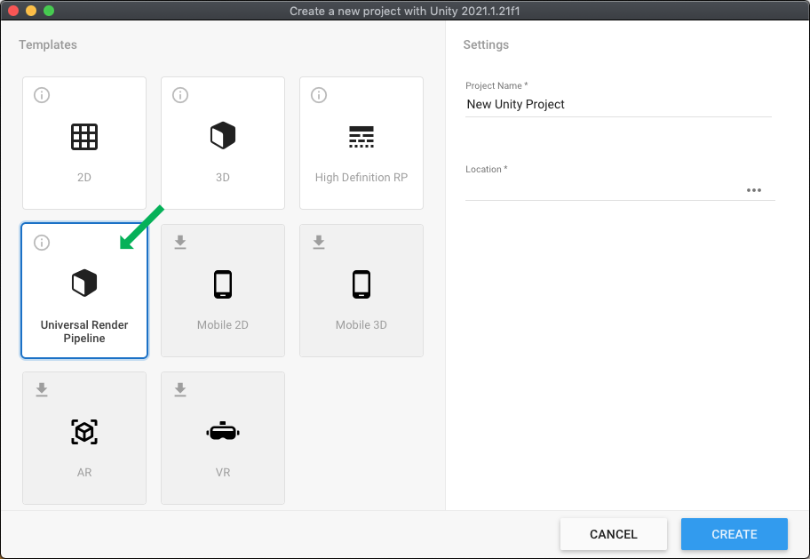
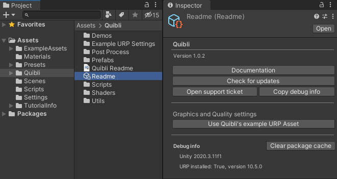
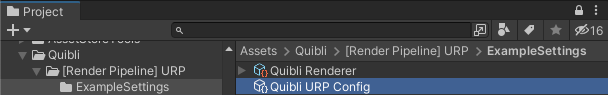
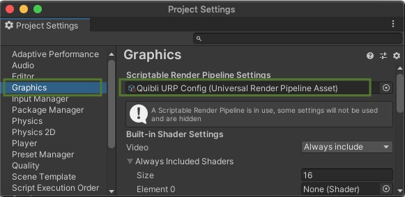
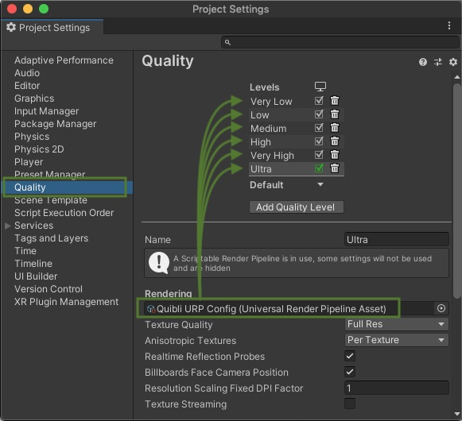
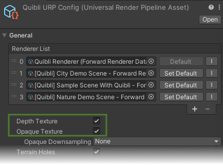

## Importing Quibli

<iframe width="560" height="315" src="https://www.youtube.com/embed/r0uKa10urQE" title="YouTube video player" frameborder="0" allow="accelerometer; autoplay; clipboard-write; encrypted-media; gyroscope; picture-in-picture" allowfullscreen></iframe> 

*A guide on downloading, importing and setting up Quibli*
{:.image-caption}

First of all, you need to import Quibli into your URP project.  
Please, make sure you have the Universal RP project running, not Built-In RP ('3D', 'Mobile 3D') or HDRP.  

 
  * In Unity, go to **Window** ▶︎ **Package Manager**; 
  * On the top left, please, find the **Packages** drop down menu. Select **My Assets** item there. You’ll find **Quibli** among your assets. Choose the version you’d like to import;  
  * Click **Download** (if it is not downloaded yet);  
  * Click **Import**;
  * Finalize Installation (either automatically, or manually — described just below).

## Finalizing Quibli Installation

After the importing, to finalize the installation it is advised to configure Quibli for Universal Rendering Pipeline. 

### Automatic Finalizing

Quibli comes with the **Readme** script tool, whose one of the jobs is to automatically configure URP to be working with Quibli. This procedure can also be done and undone manually, which is described in [Manual Finalizing](#manual-finalizing) paragraph.  

  
*Readme tool interface and its default location*  
{:.image-caption}

If you would like to use your own **Rendering Pipeline Asset File** [what's this?](https://docs.unity3d.com/Packages/com.unity.render-pipelines.universal@11.0/manual/universalrp-asset.html){:target="_blank"} instead of the one that comes with Quibli ('Quibli URP Config' file), you'll need to do it manually. The procedure is described in [Manual Finalizing](#manual-finalizing) 
{: .notice--warning}

  * Please, locate and select the **[Readme] tool** in  
_**Project** panel ▶︎ **Assets** folder ▶︎ **Quibli** folder_;  
  * In the **Inspector** panel press the **Use Quibli's Example URP Asset** button. This will set the example _Quibli Rendering Pipeline Asset_ into **Graphics** and **Quality** windows found in **Project Settings**. That's it, everything is ready now. 

### Manual Finalizing

  * Locate the **Quibli URP Config** file in  
**Project** panel ▶︎ **Quibli** folder ▶︎ **[Render Pipeline] URP** folder ▶︎ **Example Settings** folder.  
You can use your own custom settings file. The Quibli one is needed for viewing the Quibli Demo scenes.  
  
*Quibli URP Config file location*
  * Navigate to _Edit_ ▶︎ _Project Settings_;
  * Open the **Graphics** tab and select **Quibli URP Config** file in the **Scriptable Render Pipeline Settings** field;
  
*Graphics Settings Panel — select Quibli URP Config file in Scriptable Render Pipeline Settings field*
  * Open the **Quality** tab and select the same **Quibli URP Config** in the field **for all _Quality Levels_** available in your project;
  
*Quality Settings Panel — select Quibli URP Config file in Rendering field for all available quality levels*
  * Important. If you would like to use your own **Rendering Pipeline Asset File** instead of the **Quibli URP Config**, which comes with Quibli, please make sure this asset file has **Depth Texture** and **Opaque Texture** checkboxes enabled. It is required if you would like to build your project to a mobile, for example.
  
*URP Config file should have Depth Texture and Opaque Texture turned on*

**NOTE.** Should you have any difficulties with the installation of Quibli, please read through the [Troubleshooting](#troubleshooting) chapter on this page as well as have a look at the [FAQs](../faqs) page. If your questions are not answered yet, please [Report an Issue](https://github.com/dustyroom-studio/quibli-doc/issues/new/choose) or write to us to info@dustyroom.com. We should be able to help you quickly. Please, don't forget to include your set-up details like Unity and Quibli versions.
{: .notice--info}

## Troubleshooting

Below you can find typical possible issues when installing Quibli as well as other assets in Unity.  

#### Can't import Quibli
- First of all, please, make sure you downloaded Quibli using the _Package Manager_, as shown in the [video](#importing-quibli).
- If the 'Import' button is greyed out, it may be due to the known Package Manager 'cache' issue. Here is how to fix it:  
  1. Please, [locate](#automatic-finalizing) the **Readme** helper tool:  
**Project** panel ▶︎ **Assets** folder ▶︎ **Quibli** folder ▶︎ select **Readme** and go to _Inspector_ panel;  
  1. Press **Clear Cache**;
  1. Download and import Quibli from the _Package Manager_ as shown in the [video](#importing-quibli).

#### After importing, Quibli gives errors
- First, try **restarting Unity**. A simple restart indeed sometimes fixes some strange issues.
- **Re-import Quibli**. Here is how:
  1. Please, locate the **Readme** helper tool:  
**Project** panel ▶︎ **Assets** folder ▶︎ **Quibli** folder ▶︎ select **Readme** and go to _Inspector_ panel;  
  1. Press **Clear Cache**;
  1. Delete the **Quibli** folder from the **Project** panel ▶︎ **Assets** folder;
  1. Download and import Quibli from the _Package Manager_ as shown in the [video](#importing-quibli).
- Verify if the Unity version is equal or is newer than **2020.3.30f1** or **2021.3.5f1**.
- Check if you have a **Universal RP project** open. When creating a new project, it is important to choose **Universal Rendering Pipeline** and _not_ **Built-In aka '3D' or 'Mobile 3D'**.  

- Make sure you initially created your project as a URP project, not an 'upgraded from Built-in RP' one.
- Check if you have [finalized the Quibli set-up for URP](../installation/#finalizing-quibli-installation).
- Make sure that you are not using a Unity **beta** release.
- If nothing helps, please, write to info@dustyroom.com and include the screenshot of the Inspector panel of the **Readme** file, which is by default located in **Assets** folder ▶︎ **Quibli** folder.

#### After importing, some of the shaders are missing or cannot be compiled
- Check whether your setup meets the [requirements](../#requirements).
- Try a complete reimport for Quibli. [Here's how](#after-importing-quibli-gives-errors)
