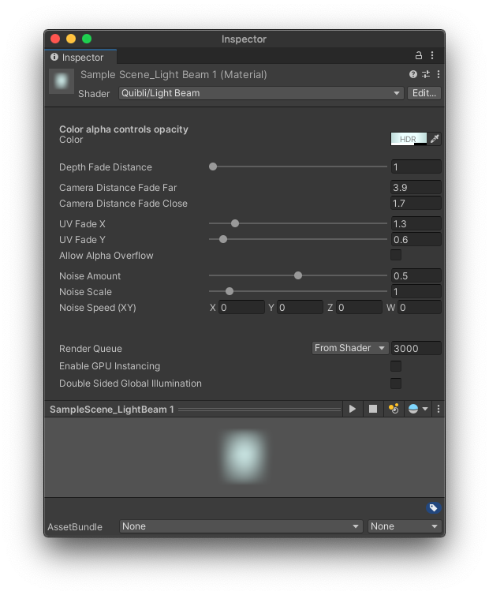

## Light Beam Shader Brief Overview

The _Light Beam_ shader can be used for the light rays as seen in the anime movies, as well as for other creative cases. For example, it can play the role of a foggy halo in the background, or a light sword.
The _Light Beam_ shader has an ability to decay with distance — once the needed parameters are set up, the halo, for instance, will be visible from distance but will gradually become less visible (more transparent) as the camera approaches it.
The _Light Beam_ is in HDR colors, meaning that it can glow if the scene has some kind of a bloom in it.

{:.image-caption}
*Quibli Light Beam Shader Interface*

**TIP.** One of the pro-looking use cases of _Light Beam_ can be highlighting some kind of a power-up item located in the scene in some distance from you, reminding you to pick it up. As you approach it, the effect has an option to decrease its intensity.
{: .notice--info}

## Beginning to Work with Light Beam Shader

1. Create a material.
1. In the **Inspector** panel, in the **Shader** drop down menu choose **Quibli** ▶︎ **Light Beam**.
Now you can apply this material to a 3D game object on your Scene or in the Hierarchy panel.

## Parameters of Light Beam Shader

- **Color** The parameter for selecting the color of the shader. As the _Light Beam_ is in additive blending mode, you cannot make dark colors with it.

**TIP.** _Color_ alpha controls opacity.
{: .notice--info}

---

- **Depth Fade Distance** Controls the visibility of objects behind the light beam. If 0, the _Light Beam_ occludes the objects behind it. If the value is high, the objects behind the _Light Beam_ are fully visible.

**TIP.** _Depth Fade Distance_ with higher values is useful for making a pseudo-fog effect.
{: .notice--info}

- **Camera Distance Fade Far** Sets the far point in the scene where the shader fades into full transparency.  If the camera is farther than this value, the beam is 100% visible (alpha is ‘1’).

- **Camera Distance Fade Close** Sets the close point in the scene where the shader fades in from transparency. If the camera is closer than this value, the beam disappears.

---

- **UV Fade X** Sets the intensity of the transparency-to-color gradient on the X axis.
- **UV Fade Y** Sets the intensity of the transparency-to-color gradient on the Y axis.

---

- **Noise Amount** Adds noise to the light beam to simulate particles flowing through the air.
- **Noise Scale** The granularity of the noise applied to the light beam.
- **Noise Speed** The rate at which the noise moves relative to the model's UV vaules. Only the X and Y fields are used.

---

- **Enable GPU Instancing** Uses GPU Instancing to render multiple copies of the mesh at once. More information in [Unity's documentation](https://docs.unity3d.com/Manual/GPUInstancing.html){:target="_blank"}.
