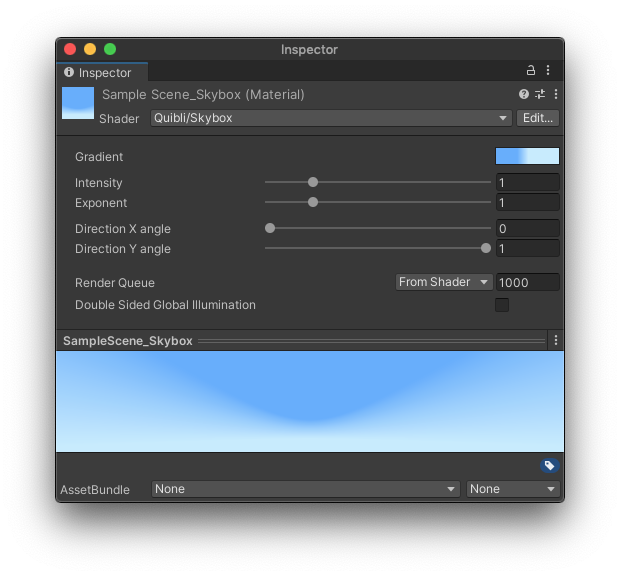

## Skybox Shader Brief Overview
The _Gradient Skybox_ shader is a modified version of the Flat Kit’s [Gradient Skybox](https://flatkit.dustyroom.com/#34-gradient-skybox-shader){:target="_blank"} shader.
Instead of two colors that you pick in two color choosers to form a gradient in the skybox, the Quibli version has a single Gradient Editor with a continuous color ramp. It means that you can have up to 8 independent color stops in the skybox with varying transition smoothness.

{:.image-caption}
*Quibli Skybox Shader Interface*

## Beginning to Work with the Skybox Shader
1. Create a material
1. In the **Inspector** panel, in the **Shader** drop down menu choose **Quibli** ▶︎ **Skybox**.

Now you can apply this material as your skybox: either drag it onto any empty spot of your scene in Game View, or go to **Lighting** panel ▶︎ **Environment** tab ▶︎ select this material in the **Skybox material** field.

## Parameters of the Skybox Shader
- **Gradient** Clicking on the colored rectangle opens a _Gradient Editor_, where you can make a gradient to be displayed on the skybox. For more info about _Gradient Editor_, please, refer to the _Gradient_ parameter description of the [Stylized Lit Shader](../stylized-lit-shader) chapter in this manual.

{:.image-caption}
*Gradient Editor in Skybox shader*

The same Gradient Editor is available for the following shaders: [Stylized Lit](../stylized-lit-shader), [Foliage](../foliage-shader), [Skybox](../skybox-shader), [Cloud3D](../cloud3d-shader), [Cloud2D](../cloud2d-shader). You can find the detailed explanation of the _Gradient_ in the ['Gradient' sub-chapter of 'Stylized Lit shader' chapter](../stylized-lit-shader/#gradient)  
{: .notice--info}

- **Intensity** Defines how strong (or bright) the skybox is.
- **Exponent** A bias towards either of the ends of the _Gradient_.

TIP. You can animate the _Exponent_ parameter for adding transition effects.
{: .notice--info}

- **Direction X Angle** Rotation in on the X axis (Pitch).
- **Direction Y Angle** Rotation in on the Y axis (Yaw).
