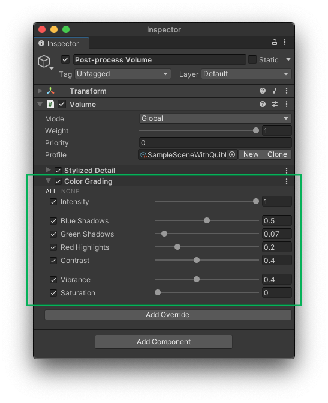

## Stylized Color Grading Post Effect Brief Overview

The _Stylized Color Grading_ includes the essence of the color correction processing — it is narrowed down for the anime-looking picture creation. Each of the parameters like _Blue Shadows_, _Green Shadows_ and _Red Highlights_ seem to be complicated in a designer work field, but in _Stylized Color Grading_ each of them were made to be working by their own formula tailored for the animation film stylistic look. Using a simplistically looking parameter slider you operate with an array of fairly sophisticated processing under the hood, which makes it very easy to use.

  
*Stylized Detail Post Effect interface*  
{:.image-caption}

## Beginning to Work with Stylized Color Grading Post Effect

**STEP 1.** The _Stylized Detail_ effect has to be added to the currently used [_Forward Renderer_](https://docs.unity3d.com/Packages/com.unity.render-pipelines.universal@11.0/manual/urp-forward-renderer.html){:target="_blank"} as a [_Renderer Feature_](https://docs.unity3d.com/Packages/com.unity.render-pipelines.universal@11.0/manual/urp-renderer-feature.html){:target="_blank"}. The _Renderer Feature_ is called **Quibli Post Process** and includes **Stylized Color Grading** and **Stylized Detail** [described here](../stylized-detail-post-effect) in the **Before Post Processing** and **After Post Processing** sections. The steps are below.  
  
*Stylized Post Effects Renderer Features loaded in Forward Renderer*. 
{: .notice--info}

  1. Locate the currently active _Forward Renderer_. It can be done in a few ways. One of them is to look at your camera’s _Inspector_ panel ▶ _Forward Renderer_ field. Search for this _Forward Renderer_, select it and look at the _Inspector_ panel;
  1. Click **Add Renderer Feature**;
  1. Locate the **Quibli Post Process** item in the menu. Select it;
  1. In the **Before Post Process** part of the _Quibli Post Process_, please, click the '+' button and select **Stylized Color Grading** in the drop down menu.

**STEP 2.** After **_STEP 1_** above is completed, as the _Stylized Color Grading_ effect is a _Volume Override_ created to be used in the _Volume_ component of the camera, it should be added as a part of the post-processing onto the camera. The steps are below.
{: .notice--info}

  1. Select a camera;
  1. Press **Add Component** on the bottom of _Inspector_ panel;
  1. Type **Volume** in the search box, or locate it manually in **Miscellaneous** ▶ **Volume**, click on it once found;
  1. Click **Add Override** in the Volume;
  1. Select **Quibli** ▶ **Stylized Color Grading**.

_Stylized Color Grading_ effect is ready to be used now.

In the _Demo Scenes_ everything has already been set up and are ready to be used. Once you set up Quibli as described in the [installation guide](../installation), all the _Forward Renderers_, _Renderer Features_ and _Volume Overrides_ are already installed and configured.
{: .notice--info}

## Parameters of Stylized Color Grading Post Effect
- **Intensity** Defines how strong the effect is;
- **Blue Shadows** Raises up the 'darks' of the blue channel of the image using a quadratic function;
- **Green Shadows** Raises up the 'darks' of the green channel of the image using a quadratic function;
- **Red Highlights** Adds a positive 'bump' in the 'lights' of the red channel;
- **Contrast** Increases the color difference of the image;
- **Vibrance** Makes colors more vivid. Works in a more subtle way than _Saturation_;
- **Saturation** Makes colors more vivid.
