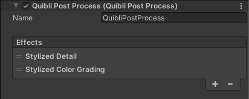

## Stylized Detail Post Effect Brief Overview
After a profound research about the stylistic directions and unique characteristics of the overall look of the Japanese animation films, we concluded the gained knowledge into a single post effect. It is a tool that helps shape these subtleties that you see or simply feel in the movies but maybe cannot put your finger on.

The _Stylized Detail_ is a post effect designed to add another layer of ‘that look’ you can see in traditional Japanese animation films (of course, it can and should be used in any creative project). Under the hood it does some complex processing to make the scene appear sharper, nuanced at the large scale and at the same time with simplified smaller details.

{:.image-caption}
*Stylized Detail Post Effect interface*

## Beginning to Work with Stylized Detail Post Effect

**STEP 1.** The _Stylized Detail_ effect has to be added to the currently used [_Forward Renderer_](https://docs.unity3d.com/Packages/com.unity.render-pipelines.universal@11.0/manual/urp-forward-renderer.html){:target="_blank"} as a [_Renderer Feature_](https://docs.unity3d.com/Packages/com.unity.render-pipelines.universal@11.0/manual/urp-renderer-feature.html){:target="_blank"}. The _Renderer Feature_ is called **Quibli Post Process** and includes **Stylized Color Grading** [described here](../stylized-color-grading-post-effect) and **Stylized Detail** in the **Before Post Processing** and **After Post Processing** sections. The steps are below.  
  
*Stylized Post Effects Renderer Features loaded in Forward Renderer*
{: .notice--info}

  1. Locate the currently active _Forward Renderer_. It can be done in a few ways. One of them is to look at your camera’s _Inspector_ panel ▶ _Forward Renderer_ field. Search for this _Forward Renderer_, select it and look at the _Inspector_ panel;
  1. Click **Add Renderer Feature**;
  1. Locate the **Quibli Post Process** item in the menu. Select it;
  1. In the **After Post Process** part of the _Quibli Post Process_, please, click the '+' button and select **Stylized Detail** in the drop down menu.

**STEP 2.** After **_STEP 1_** above is completed, as the _Stylized Detail_ effect is a _Volume Override_ created to be used in the _Volume_ component of the camera, it should be added as a part of the post-processing onto the camera. The steps are below.
{: .notice--info}

  1. Select a camera;
  1. Press **Add Component** on the bottom of _Inspector_ panel;
  1. Type **Volume** in the search box, or locate it manually in **Miscellaneous** ▶ **Volume**, click on it once found;
  1. Click **Add Override** in the Volume;
  1. Select **Quibli** ▶ **Stylized Detail**.

_Stylized Detail_ effect is ready to be used now.

In the _Demo Scenes_ everything has already been set up and are ready to be used. Once you set up Quibli as described in the [installation guide](../installation), all the _Forward Renderers_, _Renderer Features_ and _Volume Overrides_ are already installed and configured.
{: .notice--info}

## Parameters of Stylized Detail Post Effect
- **Intensity** Sets how strong the _Stylized Detail_ effect is.
- **Blur** Increases the radius of the filter. It is advised to be used subtly.
- **Edge Preserve** Keeps the edges sharp, while the _Blur_ parameter is in action.
- **Range Start**  A depth value where the effect starts to kick in.
- **Range End** A depth value where the effect ends its impact. The effect works between the _Range Start_ and _Range End_ effect. If you enable only one of these parameters and leave the other in ‘off’ state, the disabled parameter would mean ‘infinity’.
