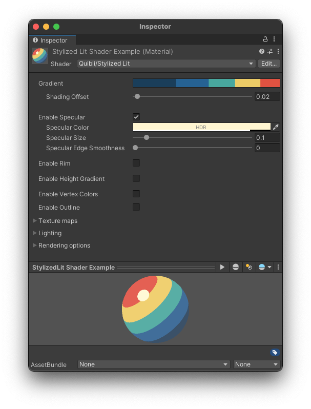
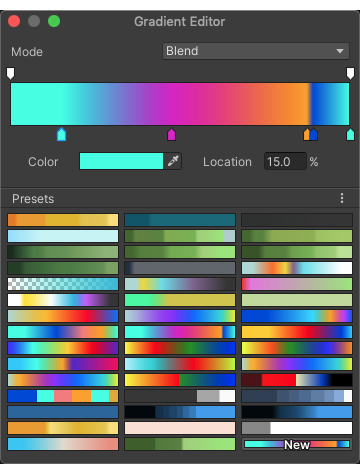
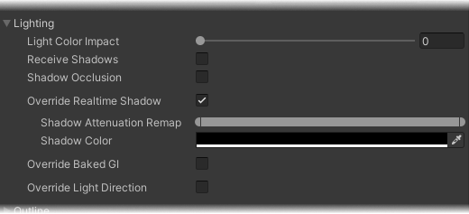

## Stylized Lit Shader Brief Overview
_Stylized Lit_ shader is a main go-to lit shader to be used in the majority of situations. It is a stylized shader, whose output ranges from a strict one-color flat surface to a cartoon style look, to a vivid acid-color experimental mess, with lots of the sweet spots in between.

{:.image-caption}
*Quibli Stylized Lit Shader. Basic view. Once the parameters are enabled, the interface is being expanded*

## Beginning to work with the Stylized Lit Shader
1. Create a material.
1. In the **Inspector** panel, in the **Shader** drop down menu choose **Quibli** ▶︎ **Stylized Lit**.
Now you can apply this material to a 3D game object on your Scene or in the Hierarchy panel.

## Parameters of the Stylized Lit Shader

### Gradient

This is one of the highlight features of Quibli shaders. Put simply, _Gradient_ (also referred as _Gradient Editor_) lets you dial in up to 8 independent colors per single material. You can make the color bands as wide or narrow as you want. In this manual we keep returning to this über-parameter with different examples.

The same Gradient Editor is available for the following shaders: [Stylized Lit](../stylized-lit-shader), [Foliage](../foliage-shader), [Skybox](../skybox-shader), [Cloud3D](../cloud3d-shader), [Cloud2D](../cloud2d-shader). You can find the detailed explanation of the _Gradient_ in the ['Gradient' sub-chapter of 'Stylized Lit shader' chapter](../stylized-lit-shader/#gradient)  
{: .notice--info}

Clicking on an icon of the _Gradient_ opens the _Gradient Editor_ where you can freely add up to eight individual independent color _breakpoints_ (color stops) and move them across the ramp. The layout of the colors on the _breakpoints_ corresponds to the layout of the colors on the scene object the material is applied to. When you move the _breakpoint_ or change the color values in _Gradient Editor_, the shading changes on the affected object(s) simultaneously, **in real time**. It is extremely useful for fine-tuning the color positions on the object. Also, it works for the models that have no UV maps.

{:.image-caption}
*Gradient Editor is real-time*

**TIP.** Whenever you make up an interesting gradient in the Gradient Editor, you can save it by pressing the ‘New’ button in the ramp presets section of the Gradient Editor. This adds an icon of the gradient to the collection, which is really useful if you want to quickly preview different possible gradients.  
  
*Using presets in the Gradient Editor*
{: .notice--info}

There are ‘smooth’ and ‘fixed’ color gradations in the Gradient editor. You can have a sharp transition from one color to another by selecting a _Fixed_ mode (using 1 color stop). If you select _Smooth_ mode, the transition from color band to the adjacent one will be gradual. See the pictures below.

{:.image-caption}
*Gradient Editor in Fixed mode — the color bands have distinct boundaries*

{:.image-caption}
*Gradient Editor in Blend mode — the color bands have gradual boundaries*

In _Smooth_ mode you can set all or some of the color stops closely to the adjacent ones to make a stepped (reminiscent of _Fixed_ mode) or partially stepped / partially smooth gradient.

{:.image-caption}
*Gradient Editor in Blend mode with partially tight color stops*

Please, note that if you would like to get a smooth gradient, your model should have smooth normals. Otherwise, even if you have the _Blend_ mode chosen, but you have a model with hard normals, you'll likely see a stepped gradient. If you have no option to edit a model, you can try adjusting the parameters in the model's _Import Settings_
{: .notice--warning}

- **Shading Offset** _Shading Offset_ moves the gradient over the model. It’s a convenience parameter, because this effect can be also made by moving all the stop points in the _Gradient Editor_.

{:.image-caption}
*Gradient Editor is real-time*

### Main Shading Parameters (Other)

- **Enable Specular** _Specular_ adds a glare to the object. It can be used for adding a small sharp ‘metallic’ specular, a matte diffused one or anything in between. Smaller values make the glare sharper, larger values smoothen the glare. Pressing _Enable Specular_ ‘on’ enables the set of parameters to control the _Specular_. _Specular_ is an HDR effect.

{:.image-caption}
*Stylized Lit Shader — Specular parameters*

- **Enable Rim** Clicking this tick box turns Rim on or off and opens a set of _Rim_ parameters.
In some cases it can be used as a contouring pseudo-outline effect, it can accentuate the edges of the models on the scene. _Rim_ depends on the main light’s rotation and the normals of the shaded model.
_Rim_ is an HDR effect. If your scene has a bloom effect enabled, _Rim_ can glow, which you can see in many anime movies.

Please, note that _Rim_ is not a substitution for the proper outline effect, like the advanced [Outline Image Effect in Flat Kit](https://flatkit.dustyroom.com/#42-outline-image-effect){:target="_blank"}.
{: .notice--warning}

- **Rim Color** Sets the color of the Rim. This parameter is in HDR.
- **Light Align** Moves the Rim on the model toward the main light (usually it is a Directional Light). This can be helpful to add stylization on larger _Rim Size_ values (see the animation below).

{:.image-caption}
*Adjusting 'Rim Align' parameter. Two spheres have different 'Rim Size' values and otherwise identical shading parameters*

- **Rim Size** How much of the model the Rim covers.
- **Rim Edge Smoothness** How smoothly the Rim fades out into the base shading. Smaller values can be used as a sharp contouring effect. Larger values combined with large **Rim Size** values can result in a soft inner glow, which can add some nonlinearities to the material look. See the animation below.

{:.image-caption}
*Adjusting 'Rim Edge Smoothness' parameter. Two spheres have different 'Rim Size' values and otherwise identical shading parameters*

- **Enable Height Gradient** Ticking this box turns _Height Gradient_ on and opens the parameters for its adjustment. _Height Gradient_ is a world-space ‘color-to-transparency fade-out’ gradient overlay placed over the material. _Height Gradient_ is an HDR effect.

**NOTE.** _Height Gradient is a world-space parameter, which means that if two objects share the same material with the _Height Gradient_ ‘on’, they share common coordinates of the _Height Gradient_, unlike, for example, the main albedo _Gradient_, whose coordinates are local per object. That’s why if you put these two objects some distance apart, they can look different. To make these objects look similar you need to create a separate material for each one.
{: .notice--warning}

{:.image-caption}
*Stylized Lit Shader — Height Gradient parameters*

**TIP.** In a _City_ Demo scene the _Height Gradient_ is sometimes used as a subtle pseudo ambient occlusion, particularly on the bottom of electric poles and houses, which otherwise would have looked kind of detached from the pavement.
{: .notice--info}

**TIP.** If your scene has some kind of a bloom effect, raising the intensity of the HDR of _Specular_, _Rim_, _Height Gradient_ parameters create a glowing effect. It can contribute to the anime look greatly.
{: .notice--info}

Once you enable _Height Gradient_, the following parameters will appear.
- **Gradient Color** This color chooser picks the source color of the gradient. The destination color is going to be the same one but transparent.
- **Center X**  The source point on the horizontal axis, from which the _Height Gradient_ is spread.
- **Center Y**  The source point on the vertical axis, from which the _Height Gradient_ is spread.
- **Size** How spread the _Height Gradient_ is.
- **Gradient Angle** Rotates the _Height Gradient_ around the **Center X** and **Center Y** values in world-space.
- **Enable Vertex Colors** If enabled, the final shading of the object is multiplied by the mesh’s vertex color values. It is a debug parameter, usually this is not used for changing the look.
- **Enable Outline** If enabled, the outline and the [group of parameters](#outline-parameters) for tweaking it will appear.

### Texture Mapping Parameters
**Texture Maps**
_Texture Maps_ is a collapsible/expandable group of parameters that control the albedo, bump (normal) and detail maps. To use these parameters, please, make sure the model is UV-unwrapped.

- **Albedo** The input for a diffuse texture. Select the texture by clicking on the _Select_ texture slot.  
_Tiling_ shrinks and repeats the texture by _X_ and _Y_ axis. Values less than 1 stretch the texture, values bigger than 1 squeeze the texture.
_Offset_ moves the texture over the UV map along _X_ and _Y_ axis.

{:.image-caption}
*Stylized Lit Shader — Albedo mapping parameters*

- **Detail Map** The input for another kind of diffuse texture. This one has two additional blending modes, which is useful for adding some kind of details into the material.  
_Tiling_ and _Offset_ parameters are the same as in _Albedo_, please look there for the description.

{:.image-caption}
*Stylized Lit Shader — Detail mapping parameters*

**TIP.** As this texture input is independent from the _Albedo_ map, you can place a copy of the texture you are using in _Albedo_ map slot, set _Blending Mode_ to _Add_ and by raising the _Detail Impact_ you will have a brighter and more contrast material. We’ve done it in the included  _Unity Default Sample Scene_ — the _Ellen_ character has an increased brightness and vividness thanks to this trick.
{: .notice--info}

**TIP.** If you don’t use any detail textures, select any color in _Detail Color_ chooser, pick an appropriate _Blending Mode_, then by adjusting the _Detail Impact_ slider you can change the overall tint of the material by moving a single control.  
  
*Using Detail Color parameter as an overall material tint*
{: .notice--info}

- **Bump Map** The input for normal maps.
_Tiling_ and _Offset_ parameters are the same as in _Albedo_, please look there for the description.

{:.image-caption}
*Stylized Lit Shader — Bump mapping parameters*

### Lighting and Shadows Parameters

#### Lighting Parameters

_Lighting_ is a collapsible/expandable group of parameters that manages the behavior of some of the important light and shadow controls.

{:.image-caption}
*Stylized Lit Shader — Lighting parameters*

- **Light Color Impact** This parameter defines how much of an influence the main light’s color has onto the material. Having this parameter allows you to add a night/day/morning/sunset feel to the scene. By automating the light’s color it is possible to achieve the day cycle effect.

#### Shadow Parameters

- **Receive Shadows** Once enabled, the mesh will receive the shadows cast from itself and other objects. Turning _Receive Shadows_ off would disable received shadows from elsewhere as well as self-shadowing.

Turning _Receive Shadows_ off is, probably, the parameter you'd want to turn off right away (it is impossible to do it automatically, since loading _Quibli Stylized Lit_ shader inherits the shadows in 'on' state — from the _Unity Standard Lit_ shader, which is loaded every time you create a new material, and which you are switching to the _Stylized Lit_ from).
{: .notice--info}

- **Shadow Occlusion** Masks received Unity shadows in areas where normals face away from the light. Useful to remove shadows that 'go through' objects.
- **Override Realtime Shadow** A tick box that enables you to replace standard Unity cast shadow with stylized cast shadow, where you can change color, intensity and edge softness. Once enabled, a few shadow-related parameters appear:
  - **Shadow Attenuation Remap** This range slider is a multi-tool, which can control the tightness, intensity and the scale of the cast shadow. Drag the left and right brackets of the range slider to tighten up or loosen down the shadow edges, move the slider by clicking and dragging its center in order to adjust the intensity. To become familiar with what this parameter does, please, experiment with it a bit.
  - **Shadow Color** This control picks up the color of the received shadow.
If _Shadow Color_’s Alpha is set to 0 in the color chooser, you’ll get Unity’s native shadows. In other words, Alpha influences the Shadow Color’s impact.
- **Override Baked GI** If the scene has baked global illumination using either [lightmaps](https://docs.unity3d.com/Manual/Lightmappers.html){:target="_blank"} or [light probes](https://docs.unity3d.com/Manual/LightProbes.html){:target="_blank"}, this toggles the _Baked Light Lookup_ gradient below.
- **Baked Light Lookup** This parameter remaps the values of Unity’s global illumination to a custom gradient. The mapping is defined by the luminance of the original GI value — darker values map to the left of the gradient and brighter values map to the right. This allows to creatively change the atmosphere of lightmapped scenes by changing only this gradient, e.g. setting the gradient to red/purple can give the scene a neon sunset look.
- **Override Light Direction** This is a particularly useful parameter. By enabling it, the material skips the light rotation information from the main light (usually Directional Light) and lets you control the lighting/shading positions manually and independently per material. In other words, if you want to rotate the gradient, shadow, specular, rim etc separately and specifically for any given model, you can do it using this feature.

### Outline Parameters
_Outline_ is a collapsible/expandable group of parameters for working with the shader-based implementation of the outlines.

{:.image-caption}
*Stylized Lit Shader — Outline parameters*

Please, notice that this outline feature is simplified as compared to [Outline Image Effect in Flat Kit](https://flatkit.dustyroom.com/#42-outline-image-effect){:target="_blank"}. In the Quibli's _Stylized Lit_ shader you have an option to quickly add a contour based on normals of the mesh, though it has a few handy parameters for making it look nice in most of the basic cases.
{: .notice--warning}

- **Color** Selects the color of the contour.
- **Width** As soon as the slider is at 0, the effect is bypassed and doesn't affect the performance. Once you start dragging the control to the right, the outline appears on the screen and is becoming thicker as long as you are moving the slider.
- **Scale** adjust this parameter when you have gaps on the vertices. Try using _Width_ at 0 or at very low value, and increase the _Scale_ parameter. Please note, this is not an ultimate solution, the gaps need a complex approach — in modelling, adjusting the normals, adjusting camera distance etc.
- **Depth Offset** Pushes the outline 'to the back of the mesh'. This is particularly useful if the mesh has lots of faces and you want it to look clean and uncluttered. When you move the slider to the right, the mesh loses the outline details inside while emphasizing its outer contour. Also, try using 0 or a very low value if the outline color interferes with the skybox.
- **Camera Distance Impact** Lets the outline change its width with the distance from the camera. If you want to make it gradually thinner as the object moves from camera, drag the slider to the right.

### Rendering Parameters
**Rendering Options**
_Rendering options_ is a collapsible/expandable group of parameters that deal with opacity and transparency alongside a few other rendering and instancing parameters.  

{:.image-caption}
*Stylized Lit Shader — Rendering parameters*

- **Surface Type** The two options are _Opaque_ and _Transparent_.
  
If _Transparent_ Surface Type is selected, the Blend Mode menu becomes available with the following Blend Mode options: _Alpha_, _Premultiply_, _Additive_ and _Multiply_.

{:.image-caption}
Blend Mode menu under Transparent Surface Type

- **Render Faces** Determines what faces to render. The three options are _Both_, _Front_, _Back_.  

{:.image-caption}
Render Faces menu

- **Alpha Clipping** Discards pixels based on the Albedo texture's alpha channel.
- **Threshold** The minimum alpha in the Albedo texture to render a pixel, i.e. determines how soon the transparent portion is ‘transparent enough’ to be cut out.
- **Enable GPU Instancing** Uses GPU Instancing to render multiple copies of the mesh at once. More information in [Unity's documentation](https://docs.unity3d.com/Manual/GPUInstancing.html){:target="_blank"}.

**TIP.** Some of the parameters, like _Rim_, _Specular_, _Height Gradient_ and others work similarly to the according parameters in the analogous _Stylized Surface_ shader in **Flat Kit**. If you didn’t find some specific info about these parameters in this manual, you might want to have a look into the [Stylized Shader chapter of the Flat Kit manual](https://flatkit.dustyroom.com/#31-stylized-surface-shader){:target="_blank"}.
{: .notice--info}

## Troubleshooting

Below you can find answers to the typical possible questions when working with Stylized Lit shader.

#### Can't apply the texture
  * Please, make sure the model you are applying the material to is UV-unwrapped.
  * If you are using a custom texture, please, make sure the format is supported.

#### Can't find Stylized Lit in the list of the shaders
  * Please try **completely** reimporting Quibli. [Here's how](../installation/#after-importing-quibli-gives-errors)
